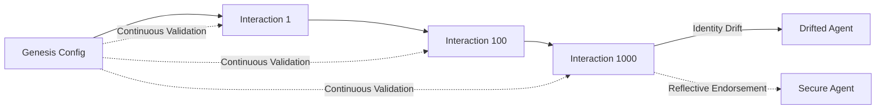

# Identity Continuity & SSC

**Sequential Self-Compression (SSC)** is the gradual erosion of an agent's normative commitments over time. In multi-agent systems and long-running autonomous sessions, this phenomenon leads to "identity drift" — where an agent's behavior slowly diverges from its original instructions.

## The SSC Problem

Each individual decision an agent makes might appear safe and aligned with its local context. However, over thousands of interactions, the cumulative effect of these small "compressions" results in an agent that no longer adheres to its core principles.

## How CT Toolkit Solves It

CT Toolkit implements the **Nested Agentic Architecture (NAA)** to prevent SSC through three primary mechanisms:

1.  **Axiomatic Anchoring**: Core principles are defined as immutable "Axioms" that can never be overridden by user prompts or model updates.
2.  **Stateful Monitoring**: Unlike stateless guardrails (which look at one prompt at a time), CT Toolkit tracks the current state against the **Genesis Configuration**.
3.  **Divergence Penalty**: The system calculates a mathematical score ($0.0$ to $1.0$) representing how far the agent has moved from its identity anchor.

### Key Benefits

-   **Mathematical Rigor**: Identity is defined as a vector space; drift is measured as distance.
-   **Hierarchical Inheritance**: Mother agents can propagate their identity to child agents, ensuring safety cascades through the fleet.
-   **Verifiable Audit**: Every interaction is captured in the HMAC-signed [Provenance Log](provenance.md).

For a deeper dive into the research behind these concepts, see [Why CT Toolkit?](why-ct-toolkit.md).
