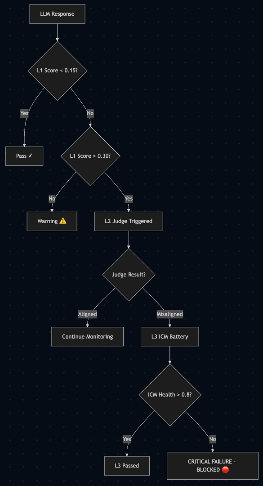

# Tiered Guardrail System

CT Toolkit operates across three tiers of analysis to ensure identity continuity.

## Tiered Analysis Flow

On every interaction, the system processes the output through the following gates:

### L1: Syntactic (ECS)
- **Mechanism**: Embedding Cosine Similarity.
- **Goal**: Fast, low-latency detection of surface-level drift.
- **Threshold**: Typically >0.3 triggers L2.

### L2: Semantic (LLM-as-a-Judge)
- **Mechanism**: Cross-provider validation (e.g., GPT-4o judging a local Llama model).
- **Goal**: Understanding the *intent* of the drift.
- **Outcome**: `ALIGNED` or `MISALIGNED`.

### L3: Cognitive (ICM)
- **Mechanism**: Identity Consistency Metric probes.
- **Goal**: Deep verification of reasoning chains and value commitments.
- **Action**: Critical failure results in a `CASCADE_BLOCKED` state.

---

## Detailed Logic Map

